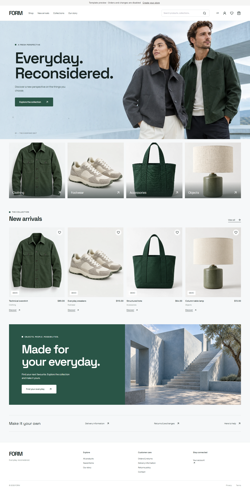

# VÉRA Commerce 2.1

A bilingual commerce platform built around the existing luxury boutique. One Node.js 24 application, one SQLite database and one Railway volume serve the marketing website, Google customer accounts, customer workspace, owner console, template previews, storefronts and merchant dashboards.

[العربية](README-AR.md) · [Complete release downloads](https://github.com/202402972-stack/vera/releases) · [FORM setup](docs/FORM-QUICKSTART-AR.md)



The platform is implemented and locally testable. Live Google sign-in and Paymob collection require your merchant credentials and provider setup; no live payment or deployment is claimed by this repository.

## Start

```bash
npm ci
cp .env.example .env
npm run dev
```

Open http://localhost:3000. Public templates are `/demo/atelier` and `/demo/form`. Google-only merchant sign-in is `/login`; merchant workspace `/workspace`; owner console `/owner`. Real stores use `/s/{slug}` and `/s/{slug}/admin`. Without Google credentials, the landing page and read-only previews still work; platform sign-in clearly shows setup is pending.

For an editable **local review only**, run `npm run build` then `npm run review:form`. Open http://127.0.0.1:3001/s/form-review. The dashboard password is `local-review-only-123`. This fixture stores demonstration inventory and test accounts under `output/review-data`, separate from production data. Never deploy the review script.

```bash
npm run build
npm start
npm test
npm run test:e2e
npm run test:platform:e2e
npm run lint
```

Production start uses `server/platform-entry.js`. The original standalone store entry remains available for regression tests and migration support, not as the public platform entry.

## What is included

- Pixells-reference palette and hero composition, original VÉRA monogram and copy, complete Arabic/English layouts, mobile navigation, reduced-motion support, locally hosted fonts, SVG logo and 1080px social avatar.
- Google OAuth authorization-code flow with PKCE, one-time state, nonce and verified ID tokens. HttpOnly hashed sessions; owner authorization is checked on the server against `OWNER_EMAILS`.
- A versioned template registry, read-only live previews, provisioned stores, distinct merchant credentials, owner-only pause/resume and password resets, and single-click entry into your own store dashboard.
- A 14-day account trial, USD 1.50 advertised starting plan, Paymob subscription integration for Egypt, verified server-to-server payment reconciliation, paid access expiry, renewal cancellation and payment history. The actual merchant currency/amount is configured separately and shown before payment.
- Owner account/store/activity overview, visits and order counts per store, store suspension, support contact and advertised price settings.
- Existing boutique storefront, brand editor, inventory, products, shipping, tax, discounts, cash-on-delivery checkout, private order receipts, tracking, analytics, Telegram notifications and scoped exports.
- Multiple merchant-managed collections with independent bilingual names/descriptions, draft/published states and multiple product membership.

## Deployment and maintenance

Read [Railway setup](docs/RAILWAY.md), [architecture and template extension](docs/ARCHITECTURE.md), [integration and launch checks](docs/INTEGRATIONS.md), and [design reference](docs/DESIGN.md).

This release uses a **single service replica**. SQLite WAL and namespaced tenant tables provide isolation within one database; they do not provide horizontal scaling or high availability. Use the documented migration boundary before moving to multiple writers. Back up the database, uploads and encryption key together. Do not deploy with an ephemeral data directory.

The platform subscription pays for the merchant's VÉRA store. It is separate from shopper payments. Cash on delivery is available by default; merchant Paymob checkout uses separate encrypted credentials configured in each store's **Payments** panel. Online checkout requires the public HTTPS deployment origin and matching merchant integrations. Custom domains are not pre-supplied.

FORM adds a separate modern, bilingual storefront with catalog search, variant filters, collections, saved items, shopper accounts, guest tracking, verified purchase reviews and merchant-managed return/exchange requests. New FORM merchant stores start without demonstration inventory. Template choice is made at creation and cannot be switched in the dashboard. Read [FORM setup and contracts](docs/FORM-IMPLEMENTATION.md) and [Arabic quick start](docs/FORM-QUICKSTART-AR.md).

See [validation](docs/VALIDATION.md) for the checks run and live-provider limitations.
