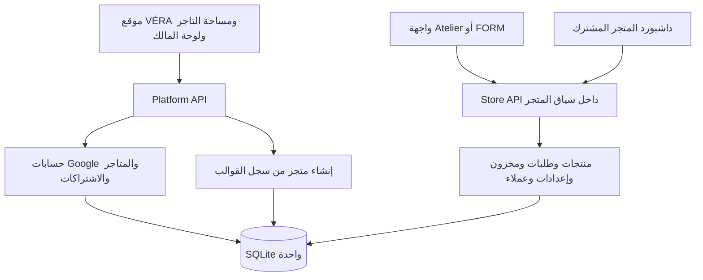

> هذا التحليل يوثق الحالة الأصلية قبل إضافة GALA. التعديلات اللاحقة موثقة في [تنفيذ GALA](GALA-IMPLEMENTATION.md).

# VÉRA — فهم المنتج وخريطة العمل

تاريخ المراجعة: 8 أكتوبر 2026. المستودع: https://github.com/202402972-stack/vera
النسخة المحلية: `/workspace/vera`، إصدار الحزمة `2.1.0`، commit `2b7abe1a16687bb3dd3275ec028f192b25389d7e`.
هذا تحليل للكود والتوثيق والتشغيل المحلي، وليس إثباتًا لتشغيل الخدمة تجاريًا أو تحصيل مدفوعات حقيقية. لم يتم تعديل ملفات المشروع أو الدفع إلى GitHub. ملفات التحليل منفصلة في `/workspace/vera-analysis`.

## 1. ما الذي تبيعه الشركة؟

VÉRA خدمة إنشاء وتشغيل متاجر إلكترونية عربية/إنجليزية للتجار والعلامات الصغيرة. التاجر يختار تصميمًا جاهزًا، يضبط هويته ومنتجاته وشحنه، ثم يدير الطلبات من لوحة مشتركة. المنصة تستضيف المتاجر وتدير حسابات التجار والوصول والاشتراكات.

العميل الذي يدفع للمنصة هو **التاجر**. **المتسوق** يشتري من متجر هذا التاجر وله حساب مستقل داخل المتجر. **مالك المنصة** يدير الخدمة ككل. لا يوجد سوق موحّد يعرض منتجات جميع التجار أو سلة تجمع عدة متاجر.

نموذج الدخل المنفذ هو اشتراك لكل متجر؛ لا تظهر في مسارات الطلبات التي تمت مراجعتها آلية عمولة للمنصة على كل عملية بيع. السعر التسويقي الافتراضي 1.50 دولار، لكن مبلغ التحصيل وعملته يأتيان من خطة الدفع وإعدادات السيرفر، ولا يتغيران بمجرد تغيير السعر المعروض في لوحة المالك.

التجربة 14 يومًا من إنشاء حساب التاجر، وليست 14 يومًا جديدة لكل متجر. الحساب يستطيع إنشاء حتى 20 متجرًا وفق الحد الموجود في `server/platform/core.js`. اشتراك Paymob الحالي يعمل بفترة 30 يومًا، والدفع المتكرر يحتاج تفعيل الخدمة فعليًا لدى مزود الدفع.

القيمة المقدمة: متجر جاهز، دعم عربي وRTL، تصميم قابل للتخصيص، إدارة منتجات وطلبات ومخزون، دفع عند الاستلام، Paymob، وإشعارات Telegram. الكود وحده لا يثبت وجود طلب سوقي أو ربحية أو عملاء دافعين.

## 2. رحلة التشغيل التجارية

1. الزائر يدخل الموقع التسويقي ويشاهد القوالب ومعايناتها.
2. يسجّل التاجر بحساب Google، ثم يدخل `/workspace`.
3. يختار اسم المتجر وعنوانه والقالب وكلمة مرور الداشبورد.
4. السيرفر ينشئ سجل المتجر وبياناته المستقلة داخل قاعدة البيانات نفسها.
5. يضيف التاجر منتجاته وخياراتها ومخزونها وصورها، والمجموعات، وسياسات البيع والشحن، والمحتوى باللغتين.
6. يضبط طرق الدفع: الدفع عند الاستلام متاح؛ Paymob يحتاج بيانات التاجر الخاصة في لوحة المتجر.
7. المتسوق يتصفح ويطلب كضيف أو بحساب محلي في المتجر. الأسعار والمخزون والإجمالي تُحسب على السيرفر.
8. التاجر يدير تجهيز الطلب والشحن والتسليم والتتبع، والتقييمات والاسترجاع. لا توجد شركة شحن مدمجة أو استرداد مالي آلي بمجرد الموافقة على الاسترجاع.
9. التاجر يجدد اشتراك المتجر لدى VÉRA؛ تعطل الاشتراك أو انتهاء التجربة يغلق الواجهة العامة مع بقاء إمكانية الإدارة. تعليق المتجر بواسطة مالك المنصة يمنع الوصول للإدارة أيضًا.

إيقاف المتجر مؤقتًا لا يلغي تجديد الاشتراك. إلغاء التجديد يحتفظ بالفترة المدفوعة. فصل الحالتين ضروري في أي تعديل لاحق.

## 3. الشاشات والحسابات

| الجزء | المسار | المسؤولية |
|---|---|---|
| الموقع التسويقي | `/`، `/templates` | التعريف بالمنصة، السعر، القوالب، بدء التسجيل |
| معاينة قالب | `/demo/atelier`، `/demo/form` | بيانات عرض مستقلة؛ الكتابة والطلبات ممنوعة |
| دخول التاجر | `/login` | Google OAuth حقيقي، لا حساب منصة افتراضي |
| مساحة التاجر | `/workspace` | متاجره، الإنشاء، الإيقاف، الاشتراك، سجل الدفع، إعادة تعيين كلمة المرور، دخول الداشبورد |
| إدارة المنصة | `/owner` | الحسابات والمتاجر والنشاط، التعليق، إعدادات السعر المعروض والدعم، إعادة التحقق من دفعة |
| واجهة المتجر | `/s/{slug}` | تجربة المتسوق الخاصة بمتجر واحد |
| داشبورد المتجر | `/s/{slug}/admin` | المنتجات والمحتوى والطلبات وتشغيل المتجر |
| حساب المتسوق في FORM | `/s/{slug}/account` | حساب محلي، الطلبات والتتبع والتقييمات والاسترجاع |

صلاحية مالك المنصة تعتمد على بريد Google الموثق داخل `OWNER_EMAILS`، وتفحص على السيرفر. لا توجد منظومة موظفين وأدوار دقيقة للمتجر؛ إدارة المتجر عبر كلمة مرور مشتركة مستقلة أو جلسة ينشئها صاحب المتجر من مساحته.

جلسة المنصة، جلسة مدير المتجر، وجلسة المتسوق منفصلة. كلمة مرور المتجر محفوظة كـ hash، وتغييرها يلغي جلسات الإدارة السابقة. حساب المتسوق في متجر لا يمنحه حسابًا في متجر آخر.

## 4. خريطة البنية



React 18 + Vite 7 للواجهة، Express 5 على Node.js 24 للخلفية، وSQLite المدمجة في Node للتخزين. التطبيق كامل يعمل في خدمة واحدة، وليس مشروعًا أو نشرًا منفصلًا لكل متجر. Railway مضبوط على replica واحدة وvolume دائم.

| الملفات | دورها |
|---|---|
| `server/platform-entry.js` | نقطة تشغيل المنصة؛ عامل دوري كل 15 ثانية لمهام الدفع والإشعارات |
| `server/platform/app.js` | APIs المنصة، الصلاحيات، ربط مسارات المتاجر، التجربة والإيقاف والتعليق |
| `server/platform/core.js` | جداول المنصة، إنشاء المتجر، النسخ الأولية، المعاينات، audit |
| `server/platform/auth.js` | Google OAuth مع PKCE والتحقق من الهوية وجلسات المنصة |
| `server/platform/paymob.js` | اشتراك التاجر في VÉRA والتحقق وإعادة المحاولة |
| `server/platform/billing.js` | محول Stripe اختياري |
| `server/index.js` | محرك التجارة الأصلي: إعدادات ومنتجات وطلبات ومخزون ورفع صور |
| `server/db.js`، `server/tenant.js` | قاعدة البيانات والعزل وسياق المتجر والتشفير |
| `server/validation.js` | عقود البيانات المقبولة؛ مهم لكل حقل تصميم أو منتج جديد |
| `server/retail.js` | حسابات المتسوقين والمفضلة والتقييمات والاسترجاع واستعادة الحساب |
| `server/shopper-payments.js` | مدفوعات مشتريات المتسوق لصالح التاجر |
| `server/collections.js` | مجموعات مستقلة؛ المنتج يستطيع الانتماء لأكثر من مجموعة |
| `server/analytics.js`، `server/exports.js`، `server/telegram.js` | التحليلات والتصدير والإشعارات |
| `src/platform/Platform.jsx` | الموقع ومساحة التاجر ولوحة المالك؛ ملف كبير يجمع عدة شاشات |
| `src/main.jsx`، `src/templates/StoreRoot.jsx` | تحديد واجهة المنصة أو المتجر وتركيب الـproviders والـrouter |
| `src/templates/registry.jsx` | اختيار renderer من قائمة imports صريحة |
| `src/App.jsx`، `src/pages/HomePage.jsx` | واجهة Atelier الأصلية |
| `src/templates/form/` | واجهة FORM وصفحات الكتالوج والمنتج والسلة والحساب |
| `src/pages/AdminPage.jsx`، `src/components/admin/` | الداشبورد المشترك وتبويباته |
| `src/api/store.js`، `src/lib/store-scope.js` | API وروابط وتخزين المتصفح تحت مسار المتجر الصحيح |
| `src/hooks/useStore.jsx`، `useCart.jsx`، `useSettingsEditor.js` | إعدادات المتجر والسلة وتحرير الإعدادات |
| `src/i18n/` | لغة الواجهة وترجمة محتوى المتجر والمنتجات |

## 5. عزل المتاجر ونموذج البيانات

جداول المنصة اسمها `platform_*` وتحتوي المستخدمين والمتاجر والجلسات والاشتراكات والنشاط. لكل متجر جداول مثل `t_1_products` و`t_1_orders` و`t_1_settings`، داخل نفس ملف SQLite. المعاينات لها namespaces مستقلة أيضًا.

السيرفر يحوّل الـslug إلى store ID، ثم يحمل هذا المعرف عبر `AsyncLocalStorage`. أدوات `db` و`stmt` تعيد كتابة أسماء جداول موثوقة إلى namespace المتجر. لا يجوز استخدام `rawDb` لقراءة بيانات متجر دون هذا العزل. Prepared statements والكاش والتصدير والمهام الخلفية يجب أن يحتفظوا بنفس السياق.

المنتجات والطلبات تحتوي جزءًا كبيرًا من البيانات في JSON. الخيارات لها IDs ومخزون وأسعار وخصائص مثل اللون والمقاس والخامة، مع جدول lookup. الطلب يحتفظ بنسخة من بيانات وأسعار المنتج وقت الشراء؛ تعديل المنتج لاحقًا لا يغيّر الطلب القديم.

المجموعات والمفضلة وبعض إعدادات الاستعادة محفوظة في settings. المجموعات تدعم مسودة/نشر وصورة ونصوصًا باللغتين، حتى 50 مجموعة وحتى 500 منتج في المجموعة وفق التحقق الحالي.

ملفات الصور عامة في `uploads/` وليست مستندات خاصة. الأسرار التشغيلية للمتجر مشفرة بمفتاح داخل مجلد البيانات. النسخة الاحتياطية الصحيحة تشمل قاعدة البيانات والصور ومفتاح التشفير معًا.

## 6. القالبان الحاليان

| الخاصية | Atelier | FORM |
|---|---|---|
| ID | `atelier` | `form` |
| Renderer | `boutique` | `form` |
| إصدار manifest الحالي | 1 | 5 |
| التصميم | بوتيك تحريري كلاسيكي | متجر عصري بصورة رئيسية واسعة وكتالوج وفلاتر |
| بيانات المتجر الجديد | تُنسخ منتجات catalogue الحالية | بدون منتجات؛ بيانات العرض في المعاينة فقط |
| حساب ومفضلة وتقييمات واسترجاع في واجهة المتسوق | ليست ضمن routes الواجهة الحالية | موجودة |
| الإدارة | الداشبورد المشترك | الداشبورد نفسه + تبويب Store design |

اختيار القالب عند إنشاء المتجر. `_template` مملوك للسيرفر ولا يمكن تغييره بحفظ إعدادات التصميم. رفع إصدار manifest يعيد بناء بيانات **المعاينة**؛ لا يبدّل قالب المتاجر القائمة ولا يعيد تهيئة منتجاتها.

تمييز مهم: بيانات المحتوى الأولية محفوظة لكل متجر، لكن كود الـrenderer مشترك في النشر. تعديل renderer مستخدم سيؤثر على جميع المتاجر التي تستخدمه؛ رقم manifest لا يثبّت نسخة كود مستقلة لكل متجر.

## 7. الداشبورد بالتفصيل

| التبويب | وظيفته وملفه |
|---|---|
| Overview | ملخص الطلبات والمخزون المنخفض وحالة التشغيل — `OperationsPanel` |
| Orders | بحث وتصفية وحالة الطلب والتتبع وإشعار Telegram — `OrdersPanel` |
| Products | المنتجات والخيارات والمخزون والصور والترجمة والترتيب، والمجموعات داخل نفس القسم — `ProductsEditor` و`CollectionsPanel` |
| Brand studio | اللوجو والألوان وبعض إعدادات الخطوط والزوايا — `BrandStudio` |
| Commerce | قبول الطلبات والشحن والضرائب والخصومات وقواعد التجارة — `CommercePanel` |
| Store content | نصوص الصفحة والمحتوى والسياسات — `ContentEditor` |
| Footer & settings | التذييل والروابط والاتصال والإعدادات المرتبطة — `ContentEditor` |
| Analytics | الزيارات والأحداث ومسار التحويل وقيم الطلبات — `AnalyticsPanel` |
| Connections | Telegram وكلمة مرور الإدارة — `IntegrationsPanel` |
| Store design | خاص بـFORM: الصورة الرئيسية وقصها للموبايل/الديسكتوب وصورة الحملة وإظهار الأقسام — `FormDesign` |
| Customers | حسابات العملاء ورابط استعادة يصدره التاجر — `RetailPanel` |
| Reviews | قبول/رفض تقييمات مشتريات مسلّمة — `RetailPanel` |
| Returns & exchanges | متابعة الطلب والرد والحالة، دون refund أو restock تلقائي — `RetailPanel` |
| Payments | بيانات Paymob الخاصة بالمتجر وإعادة التحقق من المعاملات — `PaymentsPanel` |

الاسم والمحتوى العربي مستقلان عن الإنجليزي؛ الصور وبعض إعدادات التصميم مشتركة. حفظ الإعدادات يتم باستخدام `_version` لمنع الكتابة فوق تعديل أحدث، وينعكس على `useStore` مع الحفاظ على metadata القالب.

ليس كل تحكم في Brand studio مستهلكًا بنفس الطريقة في القالبين؛ FORM يحدد خطوطًا وقيم radius مباشرة في CSS. يجب اختبار أثر أي تحكم بصري في القالب المقصود، وعدم افتراض التطابق لمجرد مشاركة لوحة الإدارة.

## 8. الطلب والدفع وما بعد البيع

السلة في المتصفح معزولة بمسار المتجر. السيرفر يعيد حساب السعر والخصم والشحن والضريبة، ويحجز المخزون مع إنشاء الطلب في transaction واحدة. مفتاح idempotency يمنع تكرار إنشاء الطلب عند إعادة الإرسال.

الدفع عند الاستلام ينشئ طلبًا ينتظر إدارة التاجر. Paymob ينشئ حجزًا ودفعًا معلقًا ينتهي بعد ساعة، وتأكيد الدفع يحتاج HMAC ثم جلب المعاملة من المزود ومطابقة المبلغ والعملة والتكامل والطلب. الرجوع من صفحة الدفع لا يساوي تأكيد الدفع. الدفع المتأخر بعد إلغاء الطلب يحتاج تسوية.

حالات الطلب: `new`، `processing`، `shipped`، `delivered`، `cancelled`. الإلغاء يعيد المخزون مرة واحدة، والطلب الملغي لا يعاد فتحه. الطلب المسلّم نهائي في هذا المسار. الطلب الإلكتروني غير المدفوع لا يدخل التجهيز أو الشحن أو التسليم.

إيصال الطلب private capability برمز عشوائي، وليس رقم طلب يمكن التخمين به. ربط طلب ضيف بحساب يحتاج رمز الإيصال والبريد المطابق. التقييم يحتاج شراء مسلّم وموافقة التاجر. استعادة الحساب رابط مفرد الاستخدام صالح 30 دقيقة، يصدره التاجر بعد التحقق خارج النظام؛ لا توجد خدمة إرسال بريد تلقائي موثقة لهذا المسار.

التحليلات تفرق بين قيمة الطلبات والتحصيل: COD المسلّم يُحسب كتقدير تحصيل، وPaymob المؤكد كدفع محصل. هذا لا يثبت تسوية شركة الشحن أو وصول الأموال للبنك، ولا يمثل نظام محاسبة كاملًا.

## 9. طريقة إضافة الستور القادم

### إذا كان متجر عميل جديد على قالب موجود

المسار الطبيعي هو `/workspace` ثم `POST /api/platform/stores`، وليس نسخ المشروع أو إنشاء deployment. المدخلات: الاسم والـslug والقالب وكلمة المرور. `provision()` ينشئ namespace وsettings وبيانات البداية ويحدد نهاية التجربة من عمر الحساب. نضبط منتجات وهوية وشحن ودفع التاجر بعد ذلك.

### إذا كان قالبًا جديدًا يظهر بجانب Atelier وFORM

1. تعريف عقد المحتوى وتجربة المتسوق: الأقسام والمنتجات والخيارات واللغتان وطرق الدفع والحساب، وما يُدار من الداشبورد.
2. إضافة defaults وصور وmanifest مستقل في `server/templates/registry.js`؛ فصل منتجات العرض عن مخزون التاجر الحقيقي.
3. تنفيذ renderer مستقل وربطه بـlazy import صريح في `src/templates/registry.jsx`.
4. استخدام `useStore` و`useCart` و`api()` و`storeUrl` و`storeKey`؛ الروابط المطلقة إلى `/api` تكسر نطاق المتجر.
5. إعادة استخدام `AdminPage` ومحرك الطلبات والدفع؛ إضافة تحرير التصميم المناسب عند الحاجة.
6. إضافة حقول التصميم الجديدة إلى `validateSettings` والترجمة وdefaults، وإلا قد تختفي عند الحفظ لأن السيرفر يعيد بناء قائمة حقول محددة.
7. مراجعة `TemplateCard` في `Platform.jsx`: الألوان والعنوان التسويقي وترقيم الكارت حاليًا شرط بين FORM وAtelier؛ مجرد التسجيل سيظهر القالب لكنه قد يرث عرض Atelier.
8. مراجعة `AdminPage` و`AdminLogin`: تبويب التصميم وبعض نصوص وهوية الإدارة مشروطة بـ`renderer === "form"`.
9. إذا أضيفت صفحات جديدة، تحديث route allowlist في `server/index.js` إلى جانب React Router، حتى تعمل الروابط المباشرة وإعادة التحميل في production.
10. إذا أضيفت جداول جديدة، إدخالها في registry العزل وتهيئة المتاجر، ووضع migration صريحة للمتاجر الموجودة. bump للقالب ليس migration للبيانات.
11. التحقق من حفظ التصميم وإعادة فتحه، والمتاجر الجديدة الفارغة، واللغتين والموبايل، والطلبات والدفع والمخزون، وفصل متجرين، وعدم تغيير المتاجر القائمة بالخطأ.

## 10. وضع التشغيل والإطلاق

المشروع مكتمل بما يكفي للتجربة المحلية الفعلية، وليس مجرد صفحات تصميم. التشغيل التجاري يحتاج إعداد Google على الدومين الحقيقي، وحساب Paymob للاشتراكات بصلاحيات recurring، وبيانات Paymob منفصلة لكل تاجر يريد الدفع الإلكتروني، وvolume دائم ونسخ احتياطية وخطة استعادة ودعم للعملاء.

التصميم الحالي يناسب بداية تشغيل على instance واحدة، لكن لا توجد نتيجة اختبار أحمال هنا تبرر عدد متاجر أو زوار معينًا. التوسع لعدة writers يحتاج تغيير طبقة التخزين وقاعدة البيانات ورفع الملفات قبل زيادة replicas.

من منظور المشروع التجاري، التحقق التالي هو قياس تاجر أنشأ متجرًا ثم نشر منتجات ثم استقبل أول طلب ثم اشترك واستمر. السعر المنخفض وحده لا يثبت جدوى؛ يلزم حساب رسوم الدفع والاستضافة والتخزين والدعم مقابل صافي إيراد كل متجر. هذه استنتاجات تخطيطية، ولا يوجد في المستودع ما يثبت CAC أو retention أو MRR فعليًا. لوحة المالك الحالية تعرض أعدادًا ونشاطًا، وليست لوحة مالية كاملة لهذه المقاييس.

## 11. ملاحظات للمراجعات المقبلة

- بعض الوثائق ما زال يقول إن Atelier هو القالب الوحيد، أو إن دفع المتسوق غير موجود؛ الكود الحالي وREADME الأساسي أحدث من تلك الفقرات التاريخية.
- تعبير «عميل/customer» قد يعني تاجر المنصة في مستندات قديمة، ويعني متسوق المتجر في retail. يجب تحديد المقصود عند إضافة feature.
- README يصف بعض صلاحيات الإدارة بإيجاز أكبر من التنفيذ. مسار reset كلمة المرور الذي تم تتبعه مقيد بصاحب المتجر، وليس إعادة تعيين عامة لأي متجر من لوحة المالك.
- متجر Atelier الجديد ينسخ catalogue، بينما FORM يبدأ فارغًا. لا نعمم سياسة البيانات الأولية على كل القوالب.
- اختبار المنصة الحالي يتوقع وجود `dist` عند import السيرفر. تشغيل الاختبارات على clone جديد قبل انتهاء build أعطى فشلًا في صفحة admin وفشلًا تابعًا في collections؛ بعد اكتمال البناء نجحت المجموعة كاملة دون تغيير الكود.
- أجزاء واسعة من المنصة في `Platform.jsx` ومن التجارة في `server/index.js`. أي تعديل مشترك يحتاج تحديد أثره على القالبين.

## 12. التشغيل المحلي والأدلة

```bash
cd /workspace/vera
npm ci
npm run build
npm test
npm run lint
npm run test:platform:e2e
npm run test:e2e
```

للتطوير: نسخ `.env.example` إلى `.env` وضبط المتغيرات المطلوبة ثم `npm run dev`؛ Vite على 3000 والخلفية على 3001. للمعاينة المستقلة دون Google: `npm run review:form` بعد البناء، ثم `http://127.0.0.1:3001/s/form-review`. بياناتها في `output/review-data`، وكلمة المرور التجريبية في README؛ لا تستخدم fixture في النشر.

نتائج هذه المراجعة:

- `npm ci`: نجح على Node `v24.19.0`.
- `npm run build`: نجح.
- `npm run lint`: نجح.
- `npm test` بعد البناء: **71/71** نجحوا.
- اختبارات المتصفح للمنصة: **11/11** نجحوا.
- اختبارات المتصفح للمتجر الأصلي: **23/26** نجحوا. الثلاثة الباقون توقفوا عند اختلافات توقعات واجهة محددة: `refinements.spec.js:86` يتوقع monogram بقيمة `B` بينما الحالي `V`؛ و`store-menu.spec.js:173` بالعربية والإنجليزية يتوقع 9 تبويبات بينما الحالي 13 بعد إضافة العملاء والتقييمات والاسترجاع والمدفوعات. لم تُعدّل الاختبارات أو الواجهة. الفحوص اللاحقة لنقطة الفشل في هذين الاختبارين لم تكتمل، فلا نعتبرهما نجاحًا شاملًا للموبايل. التفاصيل في `store-browser.log` والـtraces تحت `vera/test-results/store`.
- FORM: فحص الصفحة في العربية والإنجليزية عند 390 و1440 بكسل؛ لا overflow أفقي أو صور مكسورة رُصدت في الفحص، ودون page errors.
- دخول داشبورد FORM وفتح تبويباته الـ14؛ لا alerts أو page errors رُصدت في جولة الفتح. هذا فحص تحميل وليس اختبار حفظ لكل تبويب.
- صور المعاينة وlogs محفوظة بجانب هذا الملف.
- Google الحقيقي، Paymob الحقيقي، النشر على Railway، اختبار الأحمال، واستعادة backup لم تُنفّذ في هذه المراجعة.

نقطة البدء في الخطوة التالية: تحديد هل المطلوب متجر جديد على قالب موجود أم تصميم ثالث؛ مسارا التنفيذ موضحان أعلاه. المشروع المحلي جاهز للعمل، والمستودع بقي بلا تعديلات.
