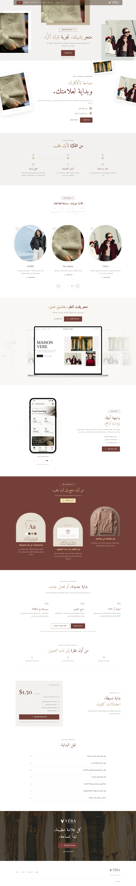


# معاينة مساحة التاجر — 10 أكتوبر 2026

استبدال صورة الإدارة الثابتة بثلاث صور توضيحية مولّدة بناءً على التصميم الأخضر الذي اختاره المستخدم: الترحيب، الدخول، والإدارة. هذه معاينات تصميمية وليست لقطات للوحة الإدارة الحالية.

- انتقال بالتلاشي والتحريك كل 5 ثوانٍ، مع تنقل يدوي وإيقاف التشغيل.
- يتوقف تلقائيًا خارج الشاشة، وعند إخفاء التبويب أو التفاعل؛ إعداد تقليل الحركة يعطّل التشغيل التلقائي والانتقالات.
- ألوان اللاندنج محفوظة، والصور بصيغة WebP؛ مجموعها نحو 285 كيلوبايت.
- نجح lint وbuild؛ فحص المتصفح بالعربية والإنجليزية بعرضي 390 و1440، وفحص التشغيل التلقائي والإيقاف اليدوي.
- الصور التالية التُقطت من الصفحة المحلية الكاملة بعد تحميل صورها، مع إيقاف الحركة وتحديد شاشة الداشبورد لتسهيل المراجعة. لا نشر للإنتاج.

## العربية

[الديسكتوب — الصفحة كاملة](landing-ar-1440.webp)

[الموبايل — الصفحة كاملة](landing-ar-390.webp)

## English

[Desktop — full page](landing-en-1440.webp)

[Mobile — full page](landing-en-390.webp)
